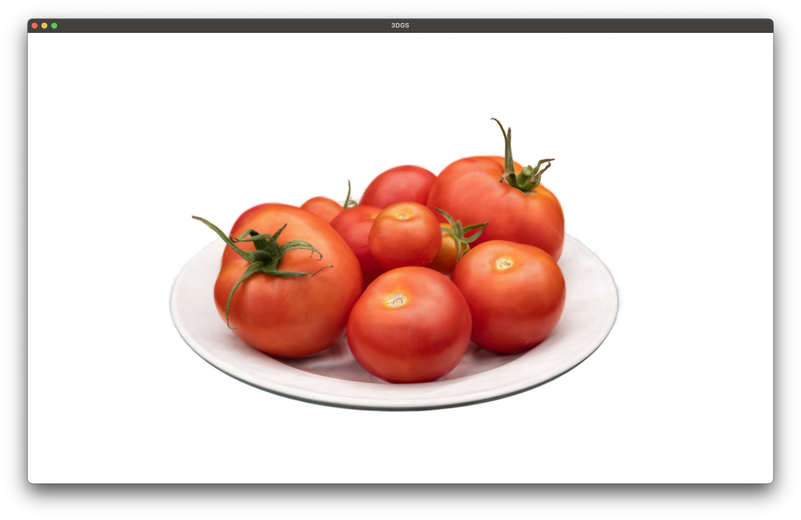

# 3DGS Weekend

This is the repo for the [3D Gaussian Splatting in a Weekend](https://bfeldman.me/3dgs-weekend/) tutorial.



## Requirements

- C++17 compiler
- GLFW 3
- OpenGL 3.3
- GLM submodule in `external/glm`

## Setup
### Install GLFW
On macOS with Homebrew:

```sh
brew install glfw pkg-config
```

### Clone with submodules:

```sh
git clone --recurse-submodules https://github.com/benjamin-feldman/3dgs-weekend.git
cd 3dgs-weekend
```

## Build

```sh
make
```

## Run

Run with a GraphDeCo-style binary little-endian 3DGS `.ply` scene:

```sh
make run PLY=/path/to/scene.ply
```

## Controls

- `W`, `A`, `S`, `D`: move camera
- `Q`, `E`: move down/up
- Arrow keys: look around
- Left mouse drag: orbit
- Mouse wheel: zoom
- `Esc`: quit
